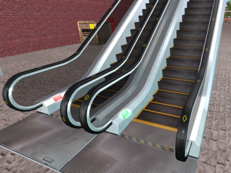

# Escalators for Second Life

These are the LSL programs for Animats escalators in Second Life.
The escalator has two parts, the frame and the steps.
Each has its own program.
The frame rezzes the steps when the frame is rezzed or moved.
The steps are animated with keyframe animation, which will move an avatar up or down the steps.

The scripts are GPL-licensed, but the escalator model is not.
