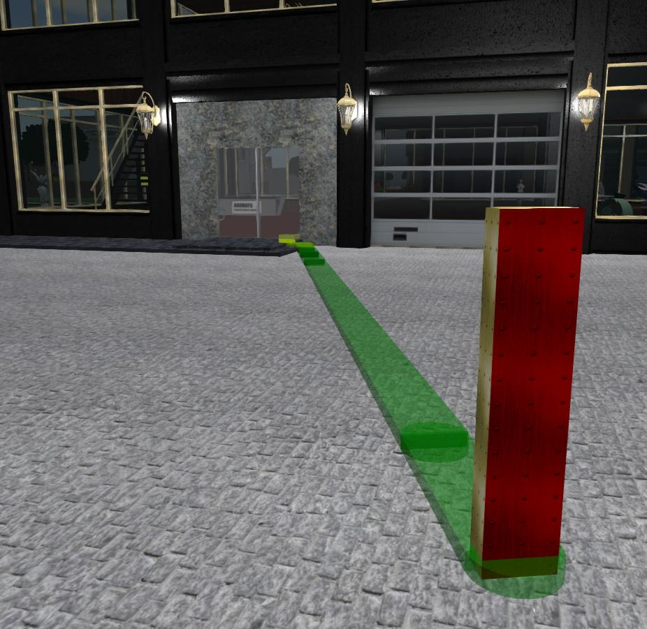
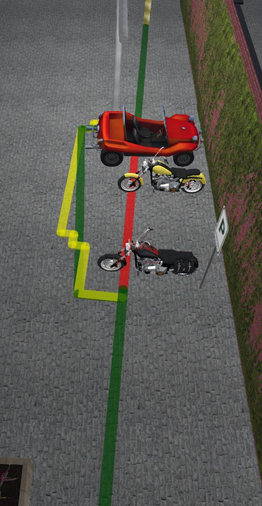

# Path planning for non-player characters in Second Life

John Nagle

Animats

December, 2019

(PRELIMINARY - WILL CHANGE BEFORE RELEASE)

## Movement and pathfinding
Second Life has a built-in pathfinding system, released in 2011. It was little used 
until the release of "animesh" in 2019, which allowed the creation of human and 
animal non-player characters similar to avatars.

Using the pathfinding system with animesh revealed major problems with pathfinding.
The problems are detailed in this bug report: https://jira.secondlife.com/browse/BUG-226391
The major issues are

* Static path planning is reasonably good
* Path following is poor and has many movement errors
* When an SL sim is overloaded, pathfinding starts to break down, and can break
down so badly that characters go flying around at high speed and get stuck in walls.

Pathfinding can be made to almost work acceptably on a lightly loaded sim, but
degrades badly under load. With overloaded sims the new normal in Second Life,
a better alternative is needed.

### Our alternative to SL pathfinding

Static path planning, from "llGetStaticPath", is reasonably good, and can generate
good paths for hard problems. Its paths are flat, on walkable surfaces; it has no
notion of character height. We use those paths as a starting point.

Paths can be checked for non-static obstacles and above the ground obstacles with
"llCastRay". So we do that. We then try to construct bypass paths around obstacles
found, using a "follow the wall" maze solver. This creates a grid, heads for the
goal, and if it hits an obstacle, follows the edge of the obstacle until an
open path to the destination appears.

All this planning is done before character movement starts. It takes about 0.5 to 5
seconds, depending on path length and clutter.

Once a path has been planned, the character follows it using keyframe animation.

*This system does not turn on the full Second Life character pathfinding system.* So there's no overhead when characters are
not moving. When they are moving, overhead seems to be about 1ms/frame for one character. (Further timing needed.)

### Path following

With a plan in place, path following can be done quickly. We are using keyframed motion to
follow the path, because
it works well under sim overload conditions. During keyframed motion, we must constantly
check for obstacles ahead of the character, using llCastRay. If an obstacle is
encountered, the character stops. We then repeat the planning process from the 
current position and try to follow the new plan.

## Path planning system usage
### Calls
### pathInit
    pathInit(float width, float height, integer chartype, integer msglev)
    
Sets up the path planning system. **width** and **height** are the dimensions of the character. **chartype**
is the pathfinding type of the character, usually **CHARACTER_TYPE_A** for humanoid forms taller than they are wide.
The **msglev** parameter turns on debugging information. Values are PATH_MSG_ERROR (which is zero). 
PATH_MSG_WARN, PATH_MSG_INFO, and PATH_MSG_DEBUG, which turn on increasing levels of debug information. 
Just put a zero there for normal operation.

The width and height define a vertical cylinder
around the character's center. The character's collision model must fit within cylinder. If it does not,
the character will bump into obstacles and stop.
### pathNavigateTo
    pathNavigateTo(vector endpos, float stopshort, float speed)
    
Go to the indicated location, in the current region, avoiding obstacles.
A moving obstacle on the path ahead of the character will stop it. So will a collision.
The calling script gets an error status via callback when this happens. It's up to the calling script to decide
what to do next. That's a social decision, and belongs to the character control script, not the
path planning system.

Stop short of the target by the distance **stopshort**. This can be zero. Used mostly when approaching an avatar.

**speed** is in meters per second. Reasonable values are 0.5 to 4.
Ordinary walking speed in Second Life is 1.5 meters/sec.

### pathPursue
    pathPursue(key target, float stopshort, integer dogged, float speed)
    
Pursue the object **target**, usually an avatar. Stop short of the target by the distance **stopshort**, so as not to get in the avatar's face.
1.75 to 2.0 meters is a reasonable value for **stopshort**. Setting **dogged** to TRUE makes the pursuit more determined and less polite.
The character will keep pursuing even if the target avatar runs away.

**speed** is in meters per second. Reasonable values are 0.5 to 4.
Ordinary walking speed in Second Life is 1.5 meters/sec.

### pathStop
    pathStop()
    
Stop any current motion. This is not usually necessary; sending a command while one is already running will stop the current movement.

## pathTurnspeed
    pathSpeed(float turnspeed)
    
Sets the turn speed. 

**turnspeed** is the turning speed when changing direction, in radians per second.
0.2 is a reasonable value. When in a path segment with both moving and turning,
movement speed is slowed to allow the turn to complete at the usual turn rate.
So characters slow down when turning corners.

## pathIgnoreOldReplies
    pathIgnoreOldReplies()
    
Discards any callback replies from previously initiated requests. Used mostly by the behavior scheduler to keep behaviors from seeing old
responses from preempted behaviors.

### Callbacks

The calling script must call

    pathLinkMsg(integer sender_num, integer num, string msg, key hitobj)
    
on each incoming link message, and must define

    pathUpdateCallback(integer callbackstat, key hitobj)
   
which will be called as each path operation completes.
**callbackstat** is one of the values in "patherrors.lsl".

**hitobj** is the key of the obstacle, for collisions and blocked paths. What to do about 
obstacles is up to the caller.

A callback with a status of 0 indicates normal completion. The character should be at the target position.
For a nonzero status, the character should be somewhere along the planned path.

The calling script should also call 

    pathTick()
    
every few seconds. This is used only for a stall timer; if something goes wrong
in the pathfinding system and it stalls, **pathUpdateCallback** will still be called,
after a long delay. So the caller can rely on getting a callback. This an emergency
backup; we've run days without needing it.

### Social aspects of movement
It's up to the calling script to decide where to go, and what to do when an obstacle is encountered.
This system just takes care of getting the character there.

The system stops movement as soon as an obstruction is detected or the character has a collision. 
The system then tries to route around the obstruction. So the system can deal with a dynamic environment.

Movement is smooth and fast but has stalls. When movement is first requested, nothing happens while the initial planning takes place.
Then movement starts. The maze solver runs concurrently with movement, but may not have finished when the first obstacle needs to be
avoided. Movement will stop for several seconds while the maze solver finishes. In overloaded sims, planning takes longer, but movement is always full speed.

Animations can help with this. We have our own animesh "animation overrider" (AO).
This causes our animesh characters to perform walk, run, turn, and stand animations as they move, switching based on velocity and turn rate. 
A "stand" animation of "looking around for where to go next" can be set, so that, during stalls while the planner catches up, the character
looks like it's trying to figure out where to go. Which it is. When no path planning and movement is in progress, the stand animation should be changed to something else.

### Prepping the parcel
The parcel must have pathfinding enabled, with walkable surfaces marked as walkable and static obstacles marked as such. Just enough that "llGetStaticPath" works. 
This can be checked by using the path testing tool in the viewer to see if a place is reachable by the static path system. Use that to help prep the parcel.
Our dynamic system takes care of minor obstacles.

A few hints:

* For at least some buildings, setting the entire building to "walkable" works. 
Floors, and even stair ramps, become walkable, and walls act as
static obstacles. This is undocumented but seems to work. 
For walkable objects, anything steeper than about 65° is a static obstacle; anything below that is a walkable surface. 
So simply marking buildings as walkable objects using Build->Pathfinding->Region Objects usually works.

* Walkable objects must be larger than 10m x 10m. That's for the linkset; you can link multiple walkable areas together to 
reach that size.

* If you need a walkable surface inside a building that's not set up for it, you can add a rug, at least 0.2m thick, and make it
walkable. An "invisible rug" will work, too. Transparent is OK, but phantom will not work.

* Many automatic doors will not react to keyframed characters. We have a script for this and will publish it separately.
The trick is to detect objects with llSensor, then check to see if they have nonzero velocity. That detectes avatars,
vehicles, SL-builtin type pathfinding characters, keyframe animated objects like these, and moving physical objects. 

* The maze solver can find a path around objects not marked as static obstacles. But it's both slow and size-limited. 
Anything bigger than a few meters across should be marked as a static obstacle if at all possible. The maze solver
is limited to 20 character widths on either side of the static path, which is usually 10 meters or so.

*Green is the static path. Red is where the static path was blocked. Yellow is the result from the maze solver.*

* Some objects, especially furniture, come with poorly chosen collision volumes. If you can walk though it with
an avatar, this path planning system will go through it. Check buildings for holes in the walls, too.

* Thin horizontal objects, such as tables, may not be detected by this system, because it's using llCastRay, and
all the rays might miss the edge of the table. If this is a problem, put an invisible solid under the table and
make it a static obstacle.

* This system can climb most stairs that avatars can climb by walking.

## License

This system is free software licensed under the [General Public License version 3.](https://www.gnu.org/licenses/gpl-3.0.en.html)
You can look at it, copy it, and create things from it, but they must also be licensed under the GPLv3. 
In Second Life terms, that means **full perms, zero cost.**

Requests for commercial use can be addressed to "nagle@animats.com".

