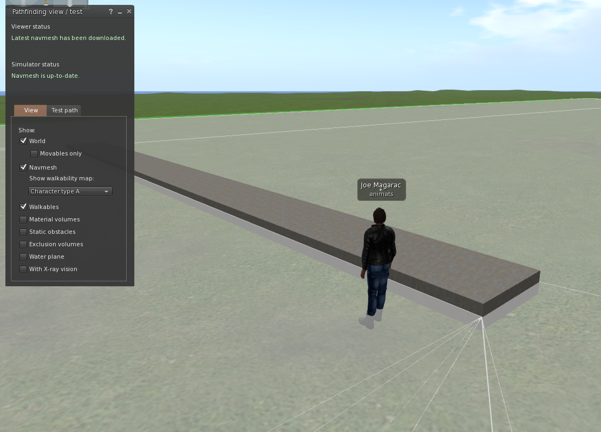
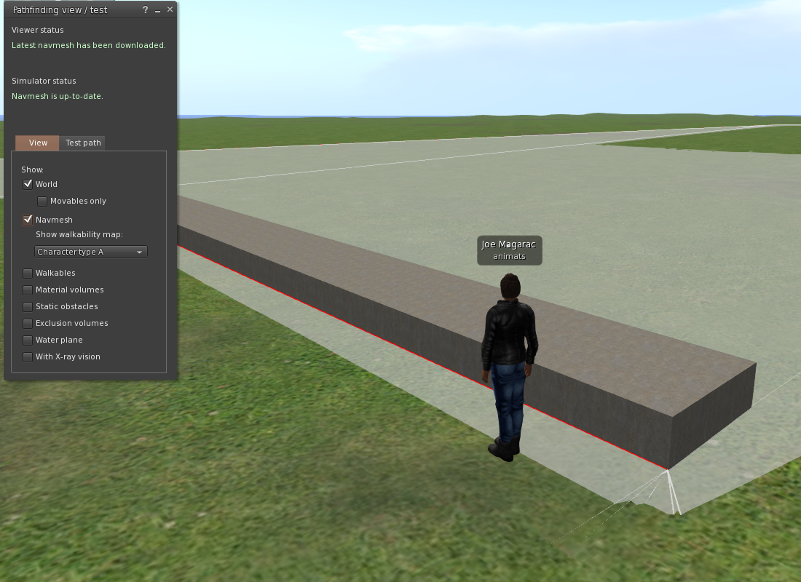

# The Second Life pathfinding system - notes

John Nagle

Animats

September, 2019

## The static navmesh

Second Life servers can precompute a static navigation mesh for path planning purposes.
This mesh is used both by the built-in pathfinding system and by the LSL call
[**llGetStaticPath**](http://wiki.secondlife.com/wiki/LlGetStaticPath). 
It represents only objects marked by the object owner as static obstacles, walkable surfaces,
or keep-out areas. All this is documented.

(PICTURE)

What the documentation doesn't tell you is that the static navmesh is only a coarse approximation to the obstacles in the
virtual world. It does not match them exactly. It does not follow every little detail.
The navmesh seems to be a low level of detail approximation 
of the world. That makes it fast to use. 
Because of this, it can only be used as a starting point for where to go.

### Z axis issues

If an block is placed on flat Linden ground, with the top of the block about 0.25m above ground,
and the block is made walkable, something strange happens.
The navmesh becomes a flat plane, above the ground and right through the middle of the block.

This looks strange. Note the avatar's feet, on the ground but below the navmesh.

Along the Z axis, the static navmesh seems to be within 0.25 to 0.35 meter of actual obstacles.

If the top of the block is 0.375m above ground, something quite different happens.

The navmesh over the ground is now at ground level.
The navmesh over the block is at the level of the top
of the block.
Those pieces of navmesh do not connect.

This is how the navmesh represents level changes which can be stepped over, versus
those which cannot.
The navmesh tester in the viewer, **llGetStaticPath**, and SL pathfinding will not cross such a break.

Calling **llGetStaticPath** returns elevations on the navmesh.
These are only an approximation to the ground level, and are not good foot positions.
Using them as foot positions will sometimes result in feet below the ground and above the ground.
Users of the navmesh must use **llCastRay** to find the ground for each point returned
by **llGetStaticPath**. As a starting point, we're doing ray casts from 0.40 above the navmesh
to 0.40 below it, looking for a walkable. 

### X and Y axis issues

The navmesh can clip the corners of obstacles.

(MORE)

