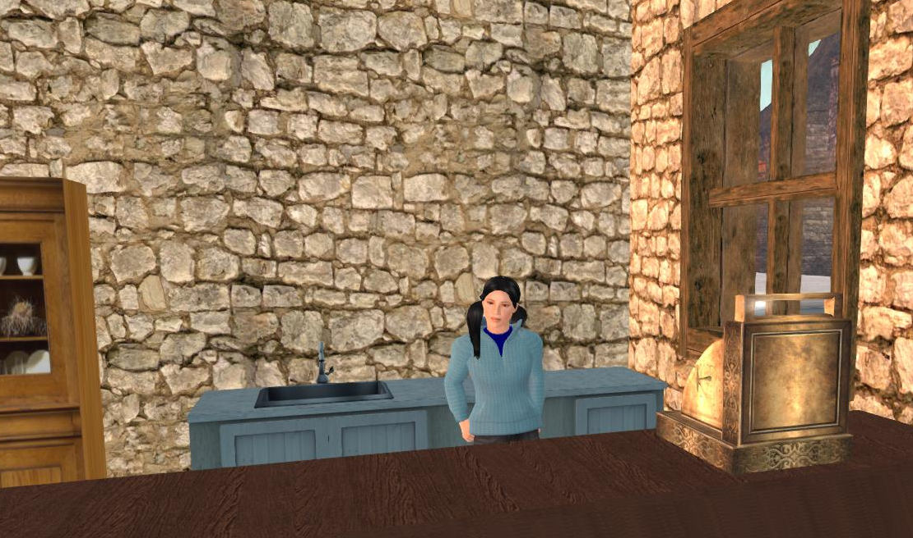
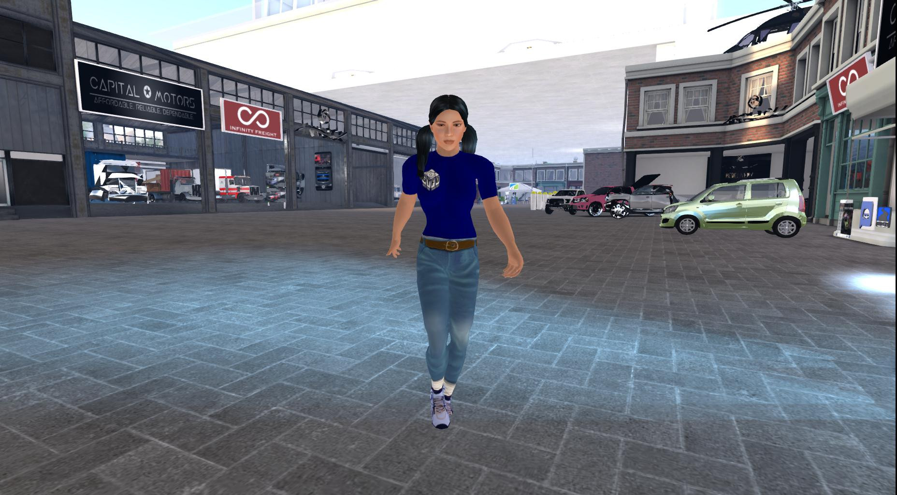
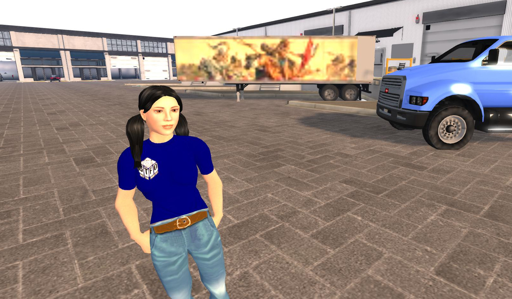
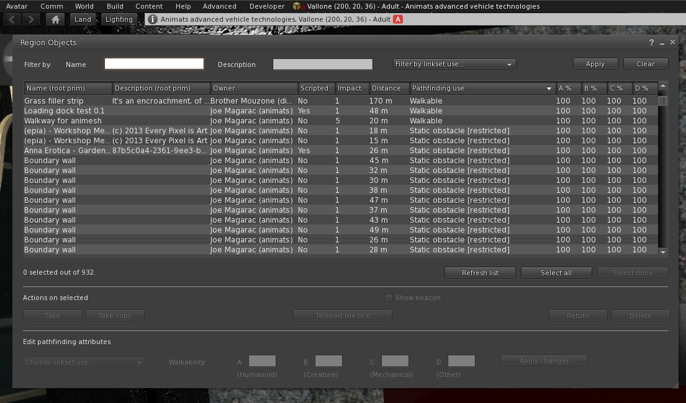

# Animats Non Player Characters
User Manual

February. 2020

Release One.

PRELIMINARY

# Introduction

You have purchased an Animats Non-Player Character.

*MORE*

## Quick Start

1. Prepare some part of your parcel for pathfinding, by making something a walkable surface. Bare ground is always walkable.

2. Rez the NPC on your own parcel. The NPC will probably not move and will report errors, because it hasn't been set up yet.

3. Make a copy of the default configuration notecard.

4. Edit the copy to add at least two patrol points in the walkable area to the notecard, as shown below.

5. Drag the notecard to the NPC and drop it on the NPC. This will restart the NPC with the new notecard.
(DRAG AND DROP NOT IMPLEMENTED YET. Configuration is in the notecard in the prim with the "bhvpatrol", etc. scripts
and has to be put there with Edit.)

6. The NPC should now go back and forth between the two points.

## Behaviors

Animats NPCs run "behaviors", scripts which handle various tasks. The default behaviors are "patrol", "greet", and "avoid".
Patrol visits a list of patrol points in random order. Greet approaches visitors and says hello. Avoid avoids vehicles.
Behaviors can interrupt other behaviors.
If an NPC is patrolling and a visitor shows up, the visitor will be approached and greeted.

If a vehicle is headed for the NPC, the NPC will take action to avoid the threat.

Advanced users can program additional behavors. Each behavior is a separate script, so behaviors are plug-ins.

## Basic configuration
The NPC has a notecard with its configuration. The important lines look like 

    #   Patrol point configuration
    #   patrol, point, REGION, POS,  DWELLTIME, HEADINGATEND
    patrol, point, Vallone, <207,15,36>, 20.0,  180.0
    patrol, point, Vallone, <202,46,36>, 20.0,  45.0
    
This tells the NPC to go to <207,15,36> in Vallone region,
turn to face heading 180 degrees (south) and wait 20 seconds. Then
go to <202,46,36>, face 45 degrees (northeast) and wait 20 seconds.
If there are more than two points, one will be chosen at random
for each move. If there are 10 points, there are 90 possible paths.

## Setting up pathfinding information for the parcel
The parcel has to be set up for pathfinding. This just means designating
objects as "walkable", "static obstacle", or "movable obstacle".

The general rule is that anything much bigger than a car needs to be marked
as a static obstacle. This is done with the pathfinding properties dialog.

Objects have to be selected by name, so if you have too many objects called "Object", you'll need to give them names.

The first step is to mark the objects you want the NPC to walk on as "walkable". Usually pavement and floors.
A linkset must be at least 10.01m x 10.01m to be walkable, so sometimes it's necessary to link objects together
to make a walkable area. 

Caution: when something is marked "walkable" or "static obstacle", it's frozen in place. *This includes doors.*
So, linksets including doors cannot be marked walkable.
Getting the NPCs through doors is somewhat complicated and will be covered separately.
We have an automatic door which is NPC-friendly. Contact our support group for info.

"Walkable" objects are only walkable on the non-vertical parts. Steeper than 65 degrees, and it's not walkable.
This is very useful. Many buildings can be marked walkable as a unit, and the pathfinding system figures
out what's walkable. Stairs can be walkable. It's best if their physics model is that of a ramp. 

Ground is always walkable, and water is never walkable.

## Advanced configuration

Animats NPCs are controlled by a configuration file, a notecard.
The notecard has lines with fields separated by commas.
Lines beginning with a "#" are comments.
Here's a sample configuration file:

### A sample configuration file

    #   Patrol point configuration
    #   patrol, point, REGION, POS,  DWELLTIME, HEADINGATEND
    patrol, point, Vallone, <207,15,36>, 20.0,  180.0
    patrol, point, Vallone, <202,46,36>, 20.0,  45.0
    patrol, point, Vallone, <217,28,36>, 20.0,  180.0
    patrol, point, Vallone, <184,13,36>, 100.0, 90.0
    patrol, point, Vallone, <236,14,36>, 100.0, 0.0
    patrol, point, Vallone, <193,32,42>, 20.0,  0.0
    patrol, point, Vallone,<240,43,36>,  20.0,  90.0
    patrol, point, Vallone,<161,46,38>,  20.0,  180.0
    #   Patrol movement speed
    patrol, speed, 2.5
    #   Patrol animations when stationary
    patrol, idling,  SEmotion-bento18
    patrol, waiting, SEmotion-bento13
    patrol, talking, SEmotion-bento18

    
    #   Chase slowly and greet politely.
    greet, speed, 2.5
    greet, msgfacing, Hello
    greet, msgnear, Hello there!
    greet, msggroup, Hello all
    #   Greet animations when stationary
    greet, idling,  SEmotion-bento18
    greet, waiting, SEmotion-bento13
    greet, talking, SEmotion-bento18

    #   Animation configuration
    animator, always, Benato Blink
    animator, slowwalk, animesh_slow_short_stride_walk
    animator, walk, Female Walk 1
    animator, stand, stand 2
    animator, run, run 1
    animator, turnleft, TurnL
    animator, turnright, TurnR

    
### Setting up patrol points.
The patrol points tell the NPC where to go. The "patrol, point" lines are
usually the only ones you have to edit.

The NPC will go randomly from patrol point to patrol point.
Patrol points are goal points; the NPC figures out how to get there on its own.
Patrol points are given one per line, in the format

    patrol, point, REGION, POSITION, DWELLTIME, HEADINGATEND
    
**patrol** and **point** identify this as a patrol point line.

**REGION** is the name of the region of the patrol point.

**POSITION** is the position of the patrol point. The third, Z, value, must be close to floor or ground level.

**DWELLTIME** is the time, in seconds, to remain at the patrol point.

**HEADINGATEND** is the direction to face when the patrol point has been reached. 0 is north, 90 is east, 180 is south, 270 is west.

Patrol points must be on a parcel owned by the same owner or group as the NPC.

(TEMPORARY) *All patrol points should be in the same region, due to a Second Life bug.*

The speed the NPC moves when patrolling is set with 

    patrol, speed, SPEED
    
**patrol** and **speed** identify this as the patrol speed setting.

**SPEED** is the speed in meters per second. 2.5 is a walk, 6 is a fast run. 6 is a little faster than an avatar can run.

The speed setting should reflect the NPC's personality and role. Most NPCs patrol at walk speed. 
We have a cute little kid who always runs fast and never spends very long in any one place.

    patrol, idling,  ANIMATION, ANIMATION,...
    patrol, waiting, ANIMATION, ANIMATION,...
    patrol, talking, ANIMATION, ANIMATION,... (NOT USED IN THIS VERSION)
    
These lines tell the NPC which animations to run when stationary and patrolling.
The ***idling*** animation will be run when the NPC is at a patrol point and waiting.
The ***waiting*** animation is run whent the NPC is preparing to move and planning the next move.
This shows up more often in overloaded sims. We usually use an arms-folded animation to show impatience.

The ***talking*** animation is not used for patrolling at this time.

Animations used should not move the root of the character very far, if at all.
The NPC system will avoid obstacles, keeping the NPC clear of walls and obstacles.
Moving around too much via animation can make the NPC look like they're inside a wall or otherwise look wrong.

### Greeting.

If desired, the NPC will find and greet anyone who shows up on the parcels. 

    greet, speed, SPEED
    
**greet** and **speed** identify this as the greet speed setting.

**SPEED** is the speed in meters per second.

This speed has a strong effect on how the NPC's personality is perceived.
2.5 will make the avatar approach at a walk, which looks polite and peaceful.
6.0 will make the avatar approach visitors at a dead run. This looks aggressive.   
    
    greet, msgfacing, MESSAGE
    greet, msgnear, MESSAGE
    greet, msggroup, MESSAGE

**msgfacing** is the message that will be delivered when the NPC reaches the avatar and stands in front of them at conversational distance.

**msgnear** is used when the avatar can't reach conversational position due to an obstacle.

**msggroup** is intended to be used when greeting a group, but is not yet being used. 

Messages can contain most characters except commas. 

    greet, idling, ANIMATION, ANIMATION,...
    greet, waiting, ANIMATION, ANIMATION, ...
    greet, talking, ANIMATION, ANiMATION,...
    
These lines tell the NPC which animation to run while doing the
indicated action. If multiple animation names are given, all
the animations will be run *simultaneously*. This is to allow
both body and facial or hand gestures.
If not present, the built-in Second Life animations will be used. 
Since many of our NPCs have bento skeletons, the default animations won't operate the fingers or facial expressions, so this is not recommended.

Animations used should not move the root of the character very far, if at all.
The NPC system will avoid obstacles, keeping the NPC clear of walls and obstacles.
Moving around too much via animation can make the NPC look like they're inside a wall or otherwise look wrong.

### Animations for moving

When the NPC is moving, an internal "animation overrider" takes over and turns on walk, run, and turn animations based on the NPC's motion.

    animator, always, Benato Blink
    animator, slowwalk, animesh_slow_short_stride_walk
    animator, walk, Female Walk 1
    animator, stand, stand 2
    animator, run, run 1
    animator, turnleft, TurnL
    animator, turnright, TurnR
    
These are optional, but the NPCs look much better with a good set of movement animations.
If you want to use your own movement animations, you can set them using the command lines above.
Our NPCs come with the above set of animations.

If you have your own set of animations, they should be be consistent with the NPC's motion.
The NPCs root should not be moved much. The animations should have smooth ease-in and ease-out, to
avoid jerks as the NPC shifts from one animation to another, which happens frequently while in
motion. 

**animator**, **always** has the list of animations which are always running. Here, an eyeblink animation is set.

